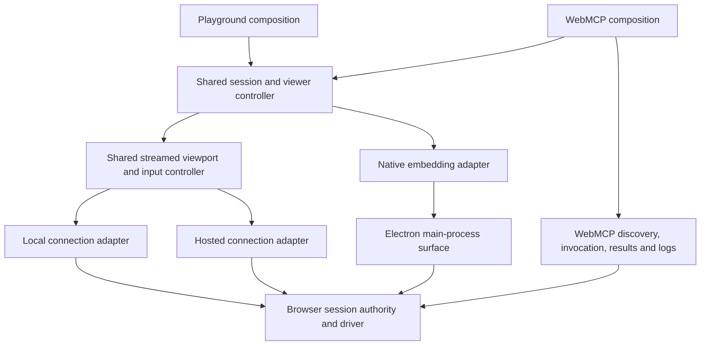

# Shared browser viewing and input

Status: revised after TL code review; implementation in progress in `refactor/shared-browser-viewer`. September 9, 2026.

## Implementation record

The first worktree PR implements the Node-local viewer/capture/input convergence. It does not mark the entire lifecycle roadmap complete.

- `BrowserPaneSurface` now serves the streamed local inspector, local Playground and hosted Playground/inspection. Its authority is explicitly shared or leased. Pointer capture, non-passive wheel, paste/IME, held-key release and Shift+Escape live there once.
- Both clients use `browser-pane/input.ts` and the canonical shared event/coalescer. Ordered socket sends pipeline with a bounded window; HTTP fallback waits for already accepted socket relay work. Long paste is chunked without splitting surrogate pairs.
- `PlaywrightWebMcpSession` retains inspection launch/bridge/popup lifecycle and delegates screencast and CDP input to `createTabViewport`. Its independent capture governor, automatic still/substitute machinery and Playwright mouse/modifier dispatcher are deleted. The interactive default is pane-sized DPR 1, stable quality 75. Explicit screenshots, API DPR 2 and native-window behavior remain.
- JPEG image loading and binary decoding each have one active decode and one newest pending picture. The producing connection owns decoded bitmaps; the surface borrows them. The inspection binary message adapter delegates to the daemon codec, preserving its existing bytes rather than introducing another wire format.
- A shared-code import guard lands with the boundary. The generated daemon bundle is rebuilt with the changed inputs.

Still open in the roadmap: extract the Local/Hosted/inspection stream lifecycle into `useFrameStream`; move frame ownership out of the inspection store and replace its SSE/poll ladder when that adapter migrates; unify per-viewer diagnostics; complete the full UI as-shipped comparison and physical-trackpad/platform matrix. These are explicit remaining work, not a fictional cross-version compatibility requirement. The Node capture/input facade is not a full browserd session-registry migration. Electron's primitive migration stays separate.

Validation status and raw timing samples are included in the PR's `docs/browser-viewer-unification-validation.md`. A capture-level comparison was recorded before and after the server change; it excludes frontend decode/display and cannot close the human-lag release criterion. That criterion remains unresolved pending a built-UI/trackpad comparison.

## Outcome

Playground and the WebMCP inspector should use the same browser-viewing and human-input implementation. Fixing scrolling, decoding, reconnects, coordinates, or keyboard handling should fix both surfaces. Local and cloud connections should differ at the connection and authority boundaries; Electron should retain native browser embedding when available.

Maintainability is the primary goal. The duplicate viewer is specifically the Node-local WebMCP `frame-stream` path. Hosted WebMCP already mounts `BrowserPanel` with `ensure={false}`, sharing `HostedBrowserBody` and `BrowserPaneSurface`. Server pacing, throttling, relay input forwarding, and the WebMCP bridge are also already shared. Remaining server duplication is local capture/input dispatch and browser lifecycle ownership. A common component over duplicated local capture/input behavior is an intermediate step, not completion. Conversely, a single component with branches for every product, platform, and codec is not the target either.

This plan follows [inspector PR #4877](https://github.com/MCPJam/inspector/pull/4877). That change removed redundant frame-driven React renders, bounded JPEG work, and improved WebMCP input transport. The user still observes lag in WebMCP that they do not observe in Playground. This is a useful reproduction lead, not proof that changing `` to canvas alone fixes the remaining latency.

## Baseline and constraints

TL verified these anchors at `8ce68c4`. The earlier session changes have landed; the implementation worktree starts from fetched main `ca99d5ed1b`. The primary checkout still contains separate local edits and is not the implementation workspace.

The current useful building blocks are:

| Existing code, relative to the inspector app package                                                           | Keep or consolidate                                                                                                                                                                     |
| -------------------------------------------------------------------------------------------------------------- | --------------------------------------------------------------------------------------------------------------------------------------------------------------------------------------- |
| `client/src/components/browser/BrowserPaneSurface.tsx`                                                         | Shared streamed picture and input surface already used by local and hosted Playground browsers. Separate reusable viewport behavior from optional control-bar composition where needed. |
| `client/src/lib/browser-shell/use-browser-session.ts`                                                          | Existing transport-independent shell state, commands, resize, and resume controller. Extend this boundary narrowly; do not invent a second session framework.                           |
| `client/src/components/browser/LocalBrowserBody.tsx`, `HostedBrowserBody.tsx`                                  | Sources for local/cloud adapters. Move repeated stream lifecycle and input behavior into the shared controller; keep provisioning and credentials in the adapters.                      |
| `client/src/components/browser/ElectronNativeBody.tsx`                                                         | Native embedding adapter. Keep native drawing, focus, visibility, and OS input.                                                                                                         |
| `client/src/lib/browser-pane/`                                                                                 | Existing JPEG reader, video decoder, painting, coordinate utilities, quality tiers, and stats. Reuse them.                                                                              |
| `client/src/components/webmcp-inspector/WebmcpInspectorTab.tsx`, `client/src/stores/webmcp-inspector-store.ts` | Retain inspection tools, results, and timeline state. Retire their independent viewport, input delivery, and frame lifecycle responsibilities.                                          |
| `server/services/webmcp-inspector/`, `server/routes/web/webmcp-frames.ts`                                      | Current local WebMCP provider/runtime and compatibility frame route. Migrate incrementally without losing inspection behavior.                                                          |
| `server/services/browserd/daemon/`, `server/services/browserd/local/`, `server/services/browserd/electron/`    | Existing browser execution stack and real platform drivers. Destination for shared capture and programmatic input behavior where feature parity permits.                                |
| `shared/browser-pane-input.ts`, `shared/webmcp-input.ts`, `shared/browser-session-state.ts`                    | Reuse canonical event/state contracts; keep old wire vocabulary conversion at the compatibility boundary.                                                                               |

The full local paths start at `../mcpjam-inspector/mcpjam-inspector/`. The older [WebMCP product plan](./webmcp-inspector.md) describes broader capabilities; this plan governs consolidation of viewing and human input, not expansion of that product scope.

## Architecture decisions

### Separate product, location, and presentation

These are independent choices:

- **Product:** Playground or WebMCP inspector. This determines surrounding UI, tool discovery, invocation, logs, and explicit session-start actions.
- **Execution location:** local machine or hosted browser. This determines launch/attachment, credentials, consent, session lookup, and routing.
- **Presentation:** streamed or native embedded. A hosted browser remains streamed even when viewed in Electron. A local Electron browser can be native. JPEG and H.264 are negotiated stream capabilities, not new engine identities.

Choose concrete adapters once at the composition boundary. Shared viewport, input, and session code must not inspect `HOSTED_MODE`, `window.isElectron`, or the current product tab to decide its behavior.

The shared viewer consumes an already resolved session. Mounting it must not create a second browser, attach it to an unrelated conversation, request consent, or provision a hosted computer. Share implementation without silently sharing sessions, profiles, or credentials between products.

### Give each responsibility one owner

| Responsibility                                                        | Owner and boundary                                                                                                                                                                                        |
| --------------------------------------------------------------------- | --------------------------------------------------------------------------------------------------------------------------------------------------------------------------------------------------------- |
| Provision/attach/find a browser; consent; hosted credentials          | Local/hosted connection adapter using existing services. Product composition decides when to request a session.                                                                                           |
| Browser/tab identity, generation, availability and capabilities       | Existing shared session controller, fed by adapter state. Distinguish unavailable, unsupported, denied, and temporarily unreadable where behavior differs.                                                |
| Open/close stream, reconnect policy, visibility, generation checks    | One shared stream controller. Adapters perform connect/auth refresh and classify transport errors; they do not each implement a retry ladder.                                                             |
| Wire parsing                                                          | Codec/legacy-wire adapters. Normalize at their boundary rather than teaching the viewport every protocol.                                                                                                 |
| JPEG decode, frame replacement and resource disposal                  | One shared streamed presenter. Dependent video decoding remains in the existing video decoder.                                                                                                            |
| Pointer/keyboard normalization, coordinates, coalescing and releases  | One shared human-input controller for streamed views. Native views use OS input, with no duplicate synthetic forwarding.                                                                                  |
| Input ordering and authority                                          | Browser-session authority on the server/main process. Order programmatic input across HTTP and sockets/viewers; retain driver-level ordering where already present. Client ordering is not the authority. |
| WebMCP tool identity, invocation/cancellation, output policy and logs | WebMCP inspection runtime/bridge. These features consume the same browser identity but do not own another viewer.                                                                                         |
| Diagnostics                                                           | Shared measurement implementation with a separate instance per viewer/session. Product-specific displays are projections, not new clocks or counters.                                                     |

Keep `useBrowserSession` as the existing 2-second state/command polling hook. Add a sibling `useFrameStream`, keyed to the same session generation, rather than putting frame traffic into that poll hook. Derive its injected transport contract from both bodies: hosted token retry limits, 4415 video fallback, and lease heartbeats are required semantics. Use small typed capabilities around the existing `BrowserSessionTransport`. Keep stream lifecycle, control authority, and native placement separate rather than adding dozens of optional methods to one interface. A discriminated streamed/native surface contract should make it impossible to attach JavaScript input forwarding to a native surface. Add abstractions only when the two real callers demonstrate the common behavior.

### Preserve authority and lifecycle semantics

Authority decision: preserve Node-local inspection’s existing shared interaction semantics—human input may proceed while an inspection tool runs. Hosted/Playground sessions retain exclusive leases. The surface takes an explicit discriminated authority, `{kind: "lease", holding}` or `{kind: "shared"}`, and derives `mayDrive`; shared inspection renders no takeover bar. Shared is a trusted server-selected session mode, never a client-provided lease bypass. Do not implement it by passing `holding: true`. Before replacing the local provider with a full daemon session, implement this mode at the session authority boundary and test interleaving, cancellation, and isolation. Reusing browserd capture/input primitives behind the existing inspection provider is a lower-risk intermediate that preserves this authority without relaxing hosted leases.

Server-side consent, ownership, lease, Origin, and session-token checks stay authoritative. Native input is admitted through main-process surface visibility/ownership rules. Do not imply a JavaScript queue orders physical native keystrokes; agent/human handoff must prevent conflicting drivers.

Bind connections, frames, queued input, and decoded resources to browser/session identity, active tab, and connection generation. Recheck before dispatch and presentation. Unmounting a viewer releases its subscription and owned resources; it must not close a browser still used by another viewer or agent. Only the last eligible watcher should stop shared capture. Hidden panes stop their own input/observation work without accidentally shutting down another visible viewer.

Preserve same-session server ordering when input falls back from socket to HTTP. An acknowledgement timeout disables that input channel while retaining a healthy frame stream; never replay a batch that may already have executed. A failed dispatch must not wedge the session queue. Preserve Playground’s existing ordered-socket pipelining and animation-frame flushing. Serialize only HTTP fallback and transport handoff barriers; do not impose WebMCP’s old one-in-flight/50 ms policy on Playground. Use the shared semantic coalescer in both clients from Stage 1, including dominant-axis reversal boundaries. Bound outstanding work and preserve releases.

### Preserve frame and measurement contracts

Keep at most one active JPEG decode and one replaceable pending JPEG. Keep only the newest picture awaiting display, and deliver the final picture when the source goes quiet. Define ownership of every bitmap, video frame, and blob URL: release exactly once on replacement, close, failure, or obsolete generation. Native surfaces allocate no streaming resources.

Do not apply JPEG frame-dropping rules to dependent H.264 frames. Reuse codec configuration/keyframe recovery and existing video fallback behavior. Node-local UI/server ship together and the WebMCP frame route is not mounted in hosted mode. Retain its wire only during a staged migration; delete its codec, SSE/poll frame rungs, and obsolete input vocabulary when the last actual consumer switches. Do not invent an old-server support window. Version negotiation remains necessary at the browserd bundle and packaged Electron boundaries. Stale browser assets should reload against their matching package.

Preserve CSS/device-pixel coordinates, letterboxing, zoom/resize behavior, modifiers, text composition/paste, drag release, and dominant-axis scroll reversal. Minor-axis trackpad jitter should coalesce without losing total distance.

Keep queue-inclusive input timing comparable with #4877 and report post-queue dispatch timing separately. State whether time in the DOM input buffer is included. Acknowledgement is dispatch completion, not visible effect; image load/canvas draw is not physical scanout. Use a marker-bearing frame for actual input-effect benchmarks. Do not subtract timestamps from different machines without a supported clock model. Keep native measurements distinct where streaming stages do not exist.

## As-shipped attribution before matching settings

Stage 0 first measures the user's actual defaults, then runs a matched configuration to isolate frontend cost. Matching settings first would hide these capture/dispatch differences:

| Factor         | Node WebMCP                                                         | Local Playground                           | Measurement                                                                       |
| -------------- | ------------------------------------------------------------------- | ------------------------------------------ | --------------------------------------------------------------------------------- |
| DPR            | Viewer DPR; DPR 2 can rasterize 2560×1600 before a 1280×800 stream  | Defaults to DPR 1                          | Raster size, CPU, paint/encode time; preserve an explicit DPR>1 capability        |
| Viewport       | Fixed 1280×800 inside a pane capped at 768px width                  | `followPane`                               | Actual page viewport, pane size and raster dimensions, not estimated pixel ratios |
| Quality        | Ladder restarts screencast at each rung change                      | Fixed quality 75 and byte cap              | Count stop/start calls and gaps during a gesture                                  |
| Extra captures | Sharp settle stills and oversize substitutes                        | No equivalent still capture                | Count screenshot captures and their overlap with input                            |
| Dispatch       | Playwright modifier sync, pointer positioning and wheel round trips | CDP dispatch per event                     | Queue wait, dispatch operations, ack time                                         |
| Client input   | 50 ms move timer and awaited batches                                | rAF batching and ordered-socket pipelining | DOM receipt, buffer wait, batch count and dispatch timing                         |

The existing marker E2E covers WebMCP only. Add its Playground counterpart before claiming parity. Run both as shipped, then with matched page/viewport/DPR/quality. Report each result separately. Attribution decides whether capture consolidation or frontend migration is the next PR; no requirement to do the less consequential layer first. A local browserd transport over `server/services/browserd/in-process-client.ts` behind the existing provider interface is a useful capture-isolation experiment, subject to the authority decision above.

## Input behavior to preserve and improve

Stage 2 is a union of proven behavior, not copying either component wholesale.

| Behavior                 | Shared target and regression test                                                                                                                                |
| ------------------------ | ---------------------------------------------------------------------------------------------------------------------------------------------------------------- |
| Drag leaves pane         | Pointer capture continues drag; cancellation/blur releases the held button. Do not end every drag at `mouseleave`.                                               |
| Wheel                    | Native non-passive listener prevents the outer inspector from scrolling. Shared coalescer preserves distance, dominant reversal, modifier and target boundaries. |
| Ctrl/Cmd+V               | Allow the host paste event and send its text once; do not send a key pair that suppresses paste. Test the actual clipboard-event sequence.                       |
| Blur mid-chord           | Release held keys/buttons and clear composition state.                                                                                                           |
| Escape                   | Adopt Shift+Esc to leave the pane for both streamed products; bare Esc reaches the inspected page. Update captions/tests.                                        |
| Right-click              | Forward the page click while suppressing the inspector's context menu.                                                                                           |
| Takeover                 | Preserve complete click/keystroke takeover on leased sessions only; shared inspection requires no ceremony.                                                      |
| IME / modifier-only keys | Preserve Playground composition handling and avoid unintended takeover on modifier-only/Process keys.                                                            |

Collapse the client `BrowserInputEvent` onto shared `BrowserPaneInputEvent` in Stage 1; keep `WebMcpInputEvent` only as a temporary edge adapter until its consumers migrate. Replace both client coalescers/inline wheel summing with shared `coalesceBrowserPaneInput`. Add the import-boundary guard in Stage 1, modeled on `client/scripts/check-renderer-tier-b-imports.mjs`. Platform policy belongs at composition, not expressions such as `preserveGestureBoundaries: !HOSTED_MODE && window.isElectron !== true` inside reusable behavior.

## Delivery sequence

Each stage has regression evidence and a removal list. Never dual-execute input. Keep native migration out of the Node lag release.

| Stage                                 | Work                                                                                                                                                                                       | Exit evidence and deletion                                                                                                                                                                                                                                              |
| ------------------------------------- | ------------------------------------------------------------------------------------------------------------------------------------------------------------------------------------------ | ----------------------------------------------------------------------------------------------------------------------------------------------------------------------------------------------------------------------------------------------------------------------- |
| 0. Record actual behavior             | As-shipped benchmark, matched comparison, Playground marker twin, authority and interaction matrix.                                                                                        | Actual active transport and raster/capture policies recorded; hypotheses remain labeled.                                                                                                                                                                                |
| 1. Shared input and stream boundaries | Canonical input type/coalescer immediately; retain socket pipelining. Extract sibling stream lifecycle from both bodies with hosted's full error/heartbeat capabilities. Add import guard. | Delete duplicate coalescing and replaced lifecycle ownership when each caller migrates. No performance regression imposed on Playground.                                                                                                                                |
| 2. Shared Node WebMCP frontend        | Use the shared surface with explicit shared authority and the behavior union above. Keep inspection metadata separate from frames.                                                         | Delete its private DOM input controller and viewport renderer; remove store frame/lifecycle responsibilities as transport moves. No frame-driven panel commits.                                                                                                         |
| 3. Shared local capture/dispatch      | Attribution may move this ahead of Stage 2. Reuse browserd viewport/input and bridge, then migrate local provider lifecycle only with shared-authority parity.                             | No independent local screencast/input algorithm remains. Inspection-specific lifecycle can remain a facade; it must not duplicate the browser driver. Document any full-session migration still needed rather than claiming a facade means complete daemon integration. |
| 4. Hosted verification                | Hosted WebMCP already shares the viewer. Verify identity, `ensure={false}`, lease behavior, token retry, JPEG/video fallback, and unchanged billing/provisioning.                          | Regression evidence, not an unnecessary hosted rewrite.                                                                                                                                                                                                                 |
| 5. Remove obsolete paths              | Delete the Node WebMCP wire/codec/input adapters and SSE/poll frame rungs when their last consumers switch. Normalize stats on shared implementation with per-viewer instances.            | No fictional local cross-version support window, no unused old/new switch. Bundle compatibility remains explicit.                                                                                                                                                       |

Stage 3 parity decisions must cover DPR>1, headed `window` mode, popup-left-open/OAuth behavior, `WebMcpNoDisplayError`, external invocation detection, iframe discovery/tool keys, declarative invocation, cancellation/uncertain outcomes, output limits and isolation. Decide whether the quality ladder and settle sharp-still survive; do not silently lose them or carry stop/start churn into the shared hot path by default. Preferred interactive default is pane-sized DPR 1 and stable capture quality; explicit high-density inspection and manual screenshots remain available. Validate text readability and byte-cap behavior before adopting that default.

When daemon bundle inputs change, run `npm run bundle:browserd`, commit changed tracked artifacts, and run freshness checks. Keep shipped daemon-version negotiation. Do not combine this work with a new codec or a 60 fps target.

## Separate Electron ticket

WebMCP currently embeds `<webview>` through `ElectronWebviewPane` and a renderer-supplied `webContentsId`; Playground uses main-process `WebContentsView` placement through `agent-surface`. This is a primitive and ownership migration, not just a component rename or a zero-provider-change refactor.

The follow-up migrates the attach handshake to main-process ownership and shared placement. Test popups/`allowpopups`, OAuth/opener behavior, focus/occlusion, session disposal and packaged Electron. Delete inspector-only `webviewTag`, `will-attach-webview` guards and never-reparent restrictions only after auditing other consumers. This ticket does not block the Node-local shared viewer/capture/input release. Existing Electron behavior remains covered by regression tests meanwhile.

## Verification and release gates

| Check                       | Required coverage                                                                                                                                                                                                                                                                     |
| --------------------------- | ------------------------------------------------------------------------------------------------------------------------------------------------------------------------------------------------------------------------------------------------------------------------------------- |
| Shared deterministic tests  | Wheel jitter/reversal/distance, modifiers, pointer capture/release, text composition/paste, coordinates at multiple scales, newest/final frame, slow/rejected decode, resource disposal, missing/late ack, timeout without frame demotion, and no uncertain replay.                   |
| Session and authority tests | Two viewers, socket/HTTP handoff, disconnect while waiting behind another caller, tab switch, browser replacement/restart, close, consent revocation, lease loss, and failure recovery. Removing a viewer cannot dispose another viewer's browser or capture stream.                  |
| Isolation tests             | Same core for both products; frame-only changes do not invalidate logs/tools/chat. Two simultaneous viewers have separate stats and resource ownership. No browser or consent request is triggered merely by mounting the viewer.                                                     |
| Real browser comparison     | Run the same long page, nested scroll area, drag target, text input, and animated input-effect marker in both tabs on the built Node package. Also check development mode, since the reported repro uses Vite.                                                                        |
| Platform matrix             | Node local on macOS/Linux/Windows; hosted from a web client; Electron local native; Electron viewing hosted streaming. Check packaged Electron visibility/occlusion/focus, not only a mocked renderer. Include a supported older server/daemon and JPEG fallback after video refusal. |
| Human and sustained checks  | Trackpad momentum and cross-axis jitter, mouse wheel, typing/selection/zoom, resume after idle, then ten minutes of mixed work. Record p50/p95 input effect latency, displayed gaps during motion, CPU, memory, queue bounds, and frame/bitmap counts.                                |

Use deterministic correctness tests as CI gates. Run real timing comparisons repeatedly on a documented machine; do not add brittle universal millisecond assertions to unit tests. Judge Node WebMCP against its own baseline and the same-machine Playground reference. Judge hosted and native against their own baselines rather than requiring identical network or rendering latency. If a refactor preserves the lag, report that result and locate the remaining stage instead of claiming shared code proves better performance.

The Node release requires shared viewing/capture/input on Node-local inspection, deletion of migrated duplicate paths, hosted/native regression checks, and measured resolution of the repro (or an explicitly unresolved release criterion). Electron primitive consolidation has its own release gate. Passing mocks alone does not establish a smooth human browser experience.

## Keep the code maintainable after migration

- Keep the shared controller free of imports from WebMCP tools/timeline, Playground chat stores, provisioning clients, and Electron IPC. Add a focused import-boundary check alongside existing repository guards.
- Keep one canonical input vocabulary and one semantic coalescer. Wire adapters may rename fields; they may not independently decide gesture behavior.
- Keep credentials inside adapters and authority on the server/main process. The viewer renders capabilities and outcomes, not deployment-specific permission guesses.
- Put frame data on a narrow subscription outside broad product stores. Maintain one lifecycle owner for a stream and one disposal owner for a decoded resource.
- Require each migration PR to list deleted responsibilities and retained compatibility code with its removal condition. Net line count is supporting evidence, not the goal.
- Prefer existing modules over a new package, plugin system, or inheritance hierarchy. A simple adapter contract with two real consumers is sufficient.

## First implementation ticket

Implement in a new inspector worktree. Start with the as-shipped inventory and Stage 1 canonical input/behavior contract. Use attribution to choose capture or frontend next, and include every stage actually completed, deferred, or blocked in the PR validation report. Keep this document as the status ledger, linking each PR and its measured exit evidence as it lands.

## PR #4882 review follow-up

The shared Node viewer/capture/input delivery remains ready for review; full roadmap completion and resolution of visible lag are not claimed. See the validation report and 30-sample candidate-geometry comparison: historical baseline 66 ms versus pane-sized DPR 1 candidate 64 ms capture arrival; same-driver geometry sweep does not show a latency win.

The shared surface preserves real mouse click counts alongside pointer capture, releases keys by physical code, restores visible keyboard focus and measures JPEG presentation at animation frame. Both products use one normalized viewport reporter. Oversized captures get one shared quality-40 restart with no oscillation. DPR 1 / quality 75 intentionally trades Retina sharpness for the Playground rendering policy; a shared settle still remains a follow-up.

Add to the next transport migration's same-PR removal list: consume the inspection socket through `createFrameWireReader` directly, then delete `PaneFrame.src`, the WebMCP blob-URL `frame-presenter.ts` accommodation and its private binary-message adapter. Keep one stream/resource owner; do not leave both presentation paths running. Shared `useFrameStream`, SSE/poll removal, unified diagnostics and the separate Electron primitive migration remain open. Hosted and Electron-viewing-hosted manual checks and the physical trackpad reproduction remain release evidence to collect.
